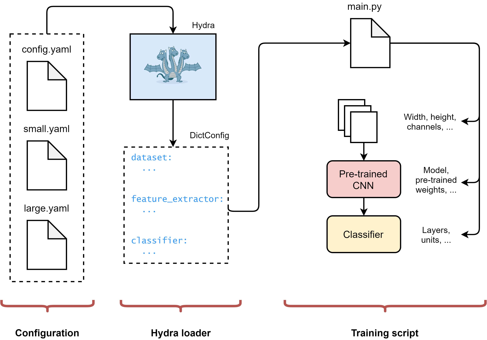
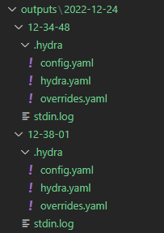

Tutorial: Hydra dla projektów Data Science
=======================================================

Celem tego poradnika jest krótkie wprowadzenie do narzędzia Hydra. Omówiono w nim podstawowe operacje bazując na materiale [Configuration Management For Data Science Made Easy With Hydra](https://www.youtube.com/watch?v=tEsPyYnzt8s).

> 🔗 Kod dla tego tutoriala jest dostępny na repozytorium GitHub: [https://github.com/ArjanCodes/2021-config](https://github.com/ArjanCodes/2021-config).

Instalacja i przegląd
------------------------------------------------------

Będziemy korzystać z wersji 1.3 (stable) biblioteki Hydra, którą można zainstalować poprzez:
```
pip install hydra-core --upgrade
```

Wprowadzenie
------------------------------------------------------
> "Hydra jest to framework typu open-source, który upraszcza rozwój badań i innych złożonych aplikacji. Kluczową cechą jest możliwość dynamicznego tworzenia hierarchicznej konfiguracji przez kompozycję i nadpisywania jej poprzez pliki konfiguracyjne i linię poleceń. Nazwa Hydra pochodzi od jej zdolności do uruchamiania wielu podobnych zadań - bardzo podobnie jak Hydra z wieloma głowami." [hydra.cc/docs/intro/](https://hydra.cc/docs/intro/)

**<font size = "5"><center>Przykład struktury Hydry dla modelu CNN</center></font>**



Po lewej stronie mamy szereg plików konfiguracyjnych, opisujących kolejno:

1.  Konfiguracja dla zbioru danych;
2.  Konfiguracja naszej wstępnie wytrenowanej sieci;
3.  Konfiguracja naszego klasyfikatora wytrenowanego "na szczycie" sieci wstępnie wytrenowanej.

W centrum, Hydra automatycznie ładuje i komponuje nasze pliki konfiguracyjne, dynamicznie nadpisując każdą wartość, którą zażądamy w czasie pracy. 

Po prawej stronie, nasz skrypt treningowy wykorzystuje wynikowy obiekt słownikowy do budowy naszego modelu.

> ⚠️ Uwaga: Będziemy usprawniać gotowy projekt dla modelu [LinearNet()](https://github.com/ArjanCodes/2021-config/tree/main/before).

main.py
------------------------------------------------------
Plik `main.py` będzie plikiem, który z wykrzystaniem bilbioteki `torch` oraz modułów z wewnątrz projektu:
- buduje model klasyfikacyjny typu LinearNet(),
- ładuje dane (zbiór MNIST),
- przeprowadza wielokrotne uczenie modelu,
- wyświetla uśrednione metryki.
```
# import zewnętrznych bibliotek
import pathlib
import torch

# import modułów z wewnątrz projektu
from ds.dataset import create_dataloader
from ds.models import LinearNet
from ds.runner import Runner, run_epoch
from ds.tracking import TensorboardExperiment

# Hiperparametry dla modelu
EPOCH_COUNT = 20
LR = 5e-5
BATCH_SIZE = 128
LOG_PATH = "./runs"

# Ścieżki do danych
DATA_DIR = "../data/raw"
TEST_DATA = pathlib.Path(f"{DATA_DIR}/t10k-images-idx3-ubyte.gz")
TEST_LABELS = pathlib.Path(f"{DATA_DIR}/t10k-labels-idx1-ubyte.gz")
TRAIN_DATA = pathlib.Path(f"{DATA_DIR}/train-images-idx3-ubyte.gz")
TRAIN_LABELS = pathlib.Path(f"{DATA_DIR}/train-labels-idx1-ubyte.gz")

# aplikacja uruchamiająca całą procedurę modelu (załadowanie danych -> uczenie modelu -> wyświetlenie metryk)
def main():

    # Model + optymalizator
    model = LinearNet()
    optimizer = torch.optim.Adam(model.parameters(), lr=LR)

    # customowa funkcja ładowania danych MNIST
    test_loader = create_dataloader(BATCH_SIZE, TEST_DATA, TEST_LABELS)
    train_loader = create_dataloader(BATCH_SIZE, TRAIN_DATA, TRAIN_LABELS)

    # customowa funkcja "dopasowująca" model do danych
    test_runner = Runner(test_loader, model)
    train_runner = Runner(train_loader, model, optimizer)

    # customowa funkcja śledzenia wyników modelu
    tracker = TensorboardExperiment(log_path=LOG_PATH)

    # iteracyjne uczenie modelu (ze względu na zadany parametr EPOCH_COUNT)
    for epoch_id in range(EPOCH_COUNT):
        # customowa funkcja uruchamiająca uczenie modelu
        run_epoch(test_runner, train_runner, tracker, epoch_id)

        # wyliczanie uśrednionych metryk z wykonanych epok
        summary = ", ".join(
            [
                f"[Epoch: {epoch_id + 1}/{EPOCH_COUNT}]",
                f"Test Accuracy: {test_runner.avg_accuracy: 0.4f}",
                f"Train Accuracy: {train_runner.avg_accuracy: 0.4f}",
            ]
        )
        print("\n" + summary + "\n")

        # Reset the runners
        train_runner.reset()
        test_runner.reset()

        # Flush the tracker after every epoch for live updates
        tracker.flush()


if __name__ == "__main__":
    main()
```

Pierwsze co możemy dostrzec, jest zbędność plików konfiguracyjnych. W celu wyczyszczenia `main.py`, przeniesiemy nasze hiperparametry oraz ścieżki do oddzielnego pliku typu `.yaml`.

config.yaml
------------------------------------------------------
Najlepszą praktyką jest utworzenie dodatkowego folderu konfiguracyjnego w projekcie, przechowującego wszystkie pliki konfiguracyjne. Plik konfiguracyjny `config.yaml` dla naszego projektu będzie wyglądał następująco:
```
# config.yaml
params:
    epoch_count: 20
    lr: 5e-5
    batch_size: 128
``` 
Tym sposobem, utworzyliśmy plik konfiguracyjny z grupą o nazwie `params` oraz z zadanymi dla tej grupy trzema wartościami.
> Należy pamiętać, aby wszelkie wartości w pliku konfiguracyjnym zapisywać **małymi literami!**

Musimy również wstępnie przygootwać `main.py`.
```
# import zewnętrznych bibliotek
import pathlib
import torch

import hydra # IMPORTOWANIE BIBLIOTEKI HYDRA

# import modułów z wewnątrz projektu
from ds.dataset import create_dataloader
from ds.models import LinearNet
from ds.runner import Runner, run_epoch
from ds.tracking import TensorboardExperiment

# Hiperparametry dla modelu
EPOCH_COUNT = 20
LR = 5e-5
BATCH_SIZE = 128
LOG_PATH = "./runs"

# Ścieżki do danych
DATA_DIR = "../data/raw"
TEST_DATA = pathlib.Path(f"{DATA_DIR}/t10k-images-idx3-ubyte.gz")
TEST_LABELS = pathlib.Path(f"{DATA_DIR}/t10k-labels-idx1-ubyte.gz")
TRAIN_DATA = pathlib.Path(f"{DATA_DIR}/train-images-idx3-ubyte.gz")
TRAIN_LABELS = pathlib.Path(f"{DATA_DIR}/train-labels-idx1-ubyte.gz")

# aplikacja uruchamiająca całą procedurę modelu (załadowanie danych -> uczenie modelu -> wyświetlenie metryk)
@hydra.main(config_path="conf", config_name="config") # WYKORZYSTANIE DEKORATORA, ABY WSKAZAĆ MIEJSCE POŁOŻENIA PLIKU KONFIGURACYJNEGO (config_path) ORAZ JEGO NAZWY (config_name)
def main(cfg):

    # Model + optymalizator
    model = LinearNet()
    optimizer = torch.optim.Adam(model.parameters(), lr=LR)

    # customowa funkcja ładowania danych MNIST
    test_loader = create_dataloader(BATCH_SIZE, TEST_DATA, TEST_LABELS)
    train_loader = create_dataloader(BATCH_SIZE, TRAIN_DATA, TRAIN_LABELS)

    # customowa funkcja "dopasowująca" model do danych
    test_runner = Runner(test_loader, model)
    train_runner = Runner(train_loader, model, optimizer)

    # customowa funkcja śledzenia wyników modelu
    tracker = TensorboardExperiment(log_path=LOG_PATH)

    # iteracyjne uczenie modelu (ze względu na zadany parametr EPOCH_COUNT)
    for epoch_id in range(EPOCH_COUNT):
        # customowa funkcja uruchamiająca uczenie modelu
        run_epoch(test_runner, train_runner, tracker, epoch_id)

        # wyliczanie uśrednionych metryk z wykonanych epok
        summary = ", ".join(
            [
                f"[Epoch: {epoch_id + 1}/{EPOCH_COUNT}]",
                f"Test Accuracy: {test_runner.avg_accuracy: 0.4f}",
                f"Train Accuracy: {train_runner.avg_accuracy: 0.4f}",
            ]
        )
        print("\n" + summary + "\n")

        # Reset the runners
        train_runner.reset()
        test_runner.reset()

        # Flush the tracker after every epoch for live updates
        tracker.flush()


if __name__ == "__main__":
    main()
```
Jak widzimy, pojawił się parametr `cfg`, który oznacza, że Hydra automatycznie wprowadzi parametry z pliku `config.yaml` do funkcji `main()`.

Dodajmy również pliki do pliku konfiguracyjnego. W tym celu dodamy kolejną grupę `files`.

```
# config.yaml
files:
    test_data: t10k-images-idx3-ubyte.gz
    test_labels: t10k-labels-idx1-ubyte.gz
    train_data: train-images-idx3-ubyte.gz
    train_labels: train-labels-idx1-ubyte.gz
params:
    epoch_count: 20
    lr: 5e-5
    batch_size: 128
``` 

Zauważmy, że ścieżki również warto trzymać w pliku konfiguracyjnym, ponieważ da nam to lepszą kontrolę nad strukturą projektu, tj.:

```
# config.yaml
files:
    test_data: t10k-images-idx3-ubyte.gz
    test_labels: t10k-labels-idx1-ubyte.gz
    train_data: train-images-idx3-ubyte.gz
    train_labels: train-labels-idx1-ubyte.gz
paths:
    log: ./runs
    data: ../data/raw
params:
    epoch_count: 20
    lr: 5e-5
    batch_size: 128
``` 

> Usunięcie cudzysłowów ze ścieżek jest związane z plikami typu `.yaml`, ponieważ nie mają one potrzeby ich używania.

Uwaga. Należy zabezpieczyć nasz plik konfiguracyjny przed nieprawdiłowym wskazaniem ścieżki. W tym celu wykorzstamy hydrę i zawrzemy w ścieżce do danych  informację o katalogu bieżącym.

```
# config.yaml
files:
    test_data: t10k-images-idx3-ubyte.gz
    test_labels: t10k-labels-idx1-ubyte.gz
    train_data: train-images-idx3-ubyte.gz
    train_labels: train-labels-idx1-ubyte.gz
paths:
    log: ./runs
    data: ${hydra:runtime.cwd}/../data/raw
params:
    epoch_count: 20
    lr: 5e-5
    batch_size: 128
``` 

Tym sposobem, nasza ścieżka do danych, wychodzi z katalogu bieżącego do wskazanego.

Jak to widzi Hydra? Po "wyprintowaniu" pliku konfiguracyjnego:
```
import hydra

@hydra.main(config_path="conf", config_name="config")
def main(cfg):
    print(cfg)
    return

if __name__ == "__main__":
    main()
```

ukazuje się nam słownik z parametrami:

```
{
    "files": {
        "test_data": "t10k-images-idx3-ubyte.gz",
        "test_labels": "t10k-labels-idx1-ubyte.gz",
        "train_data": "train-images-idx3-ubyte.gz",
        "train_labels": "train-labels-idx1-ubyte.gz",
    },
    "paths": {"log": "./runs", "data": "../data/raw"},
    "params": {"epoch_count": 20, "lr": 5e-05, "batch_size": 128},
}
```

Dodatkowo, hydra każdrowazowo zapisuje plik konfiguracyjny w folderze output, który tworzony jest automatycznie, co pozwala nam śledzić wszelkie modyfikacje.



Tym sposobem, otrzymaliśmy podstawowy plik konfiguracyjny zawierający wszystkie parametry/dane/ścieżki.

Wprowadźmy je do `main.py`:

```
import hydra  # IMPORTOWANIE BIBLIOTEKI HYDRA

# import modułów z wewnątrz projektu
from ds.dataset import create_dataloader
from ds.models import LinearNet
from ds.runner import Runner, run_epoch
from ds.tracking import TensorboardExperiment

@hydra.main(config_path="conf", config_name="config")
def main(cfg):

    # Model + optymalizator
    model = LinearNet()
    optimizer = torch.optim.Adam(model.parameters(), lr=cfg.params.lr)

    # customowa funkcja ładowania danych MNIST
    test_loader = create_dataloader(
        cfg.params.batch_size,
        pathlib.Path(f"{cfg.paths.data}/{cfg.files.test_data}"),
        pathlib.Path(f"{cfg.paths.data}/{cfg.files.test_labels}"),
    )
    train_loader = create_dataloader(
        cfg.params.batch_size,
        pathlib.Path(f"{cfg.paths.data}/{cfg.files.train_data}"),
        pathlib.Path(f"{cfg.paths.data}/{cfg.files.train_labels}"),
    )

    # customowa funkcja "dopasowująca" model do danych
    test_runner = Runner(test_loader, model)
    train_runner = Runner(train_loader, model, optimizer)

    # customowa funkcja śledzenia wyników modelu
    tracker = TensorboardExperiment(log_path=cfg.paths.log)

    # iteracyjne uczenie modelu (ze względu na zadany parametr EPOCH_COUNT)
    for epoch_id in range(cfg.params.epoch_count):
        # customowa funkcja uruchamiająca uczenie modelu
        run_epoch(test_runner, train_runner, tracker, epoch_id)

        # wyliczanie uśrednionych metryk z wykonanych epok
        summary = ", ".join(
            [
                f"[Epoch: {epoch_id + 1}/{cfg.params.epoch_count}]",
                f"Test Accuracy: {test_runner.avg_accuracy: 0.4f}",
                f"Train Accuracy: {train_runner.avg_accuracy: 0.4f}",
            ]
        )
        print("\n" + summary + "\n")

        # Reset the runners
        train_runner.reset()
        test_runner.reset()

        # Flush the tracker after every epoch for live updates
        tracker.flush()


if __name__ == "__main__":
    main()
```

----
Podsumowując, udało nam się przenieść parametry do jednego pliku konfiguracyjnego, co pozwoliło na zwiększenie przejrzystości głównego skryptu oraz, co najważniejsze, pozwala na kontrolowanie parametrów modelu/ścieżek/źródeł danych dla całego projektu.

Mimo, że wykorzystaliśmy tylko fundamentalne reguły pakietu `Hydra`, a już to pozwaliło nam na śledzenie pracy nad projektem poprzez zapis konfiguracji w folderze `outputs`, co jest ogromną zaletą.


