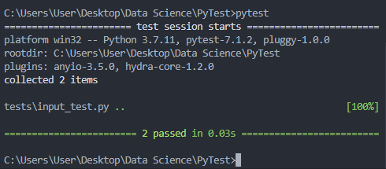

# Get Started with Pytest

Pytest jest framework-iem, który ułatwia pisanie testów jednostkowych w Pythonie. Pomaga to osiągać *minimalnym* kodem. Jest również świetnym narzędziem do rozpoczęcia nauki testowania funkcji.

## Intro

"*Test jednostkowy – metoda testowania tworzonego oprogramowania poprzez wykonywanie testów weryfikujących poprawność działania pojedynczych elementów programu – np. metod lub obiektów w programowaniu obiektowym lub procedur w programowaniu proceduralnym.*" [Wikipedia](https://pl.wikipedia.org/wiki/Test_jednostkowy)

Na wstępie należy podkreślić dwa fakty:
1. Testy powstały z myślą o **aplikacjach**, co oznacza, że mają one testować **metody** z danych **klas** np. czy zwracają odpowiedni format, wymiar, czy nie ma nulli itp. Jest to najwygodniejsza forma to rozbudowanych aplikacji.

> Ponieważ w naszym projekcie będziemy głównie wykorzystywać notatniki, testy będą używane wciąż poprawnie, ale nie do końca "*zgodnie ze sztuką*".

2. W programowaniu TDD (Test-driven development), wychodzi się od **wpierw** napisania testów, a następnie napisania aplikacji.

> Z uwagi na nierównomiene rozłożenie umiejętności w programowaniu TDD wewnątrz zespołu, ta metodyka nie będzie wymuszana podczas tworzenia aplikacji.

# Aplikacja

## Struktura

Standardowa struktura projektu (z reguły) zawiera folder */tests*. Służy on przechowywaniu funkcji testujących (testów jednostkowych). Natomiast aplikacja będzie przechowywana w innym folderze np. */app*, */model*, */predictor* itp.

Utwórzmy strukturę naszej aplikacji:
```
PyTest:
    app:
        __init__.py
        bmi_calc.py
        bmi_calc.ipynb
    tests:
        __init__.py
        input_test.py
```

> Uwaga! Pytest **odszukuje** testy jednostkowe po nazwach plików. Jeżeli wykryje plik rozpoczynający się od "test" lub kończący się na "test", tj. test_* lub *_test, wtedy **domyślnie** uzna ten plik za test jednostkowy i będzie z niego korzystać. Dodatkowo, należy pamiętać, aby **testy jednostkowe (funkcje) rozpoczynały się od `test_*`**!

## Uruchamianie

Jeżeli chcemy uruchomić nasze testy:
- w przypadku obiektowym - wywołujemy komendę `pytest` w folderze nadrzędnym (w naszym przypadku /bmi_project), poprzez wykorzystanie terminala


*Oczywiście, jeszcze nie napisaliśmy żadnych testów, zatem żaden test nie został uruchomiony.*

- w przypadku notatnika - możemy skorzystać z komendy `!pytest ../tests`, gdzie *tests* jest wskazaniem folderu zawierającego testy jednostkowe

]]

## Przykładowy test

Napiszmy pierwszy przykładowy test jednostkowy (funkcję) w pliku `PyTest/tests/input_test.py`. Chociaż jeszcze nie wiemy czym właściwie jest aplikacja `bmi_calc`, to nie będzie to stwarzało probelmów, ponieważ test będzie *"przechodził"* niezależnie od niej.
```
def test_first():
    pass
```
*Zwróć uwagę na nazwę testu jednostkowego (funkcji).* 

Po ponownym uruchomieniu testów dla scenariusza obiektowego jak i notatnikowego otrzymujemy odpowiednio:

]]

]]

---
## Przypadek obiektowy

Zacznijmy od zbudowania prostej klasy `Osoba`.
```
class Osoba:
    def __init__(self, plec: bin, wzrost: int, waga: int): # 1 - male, 0 - female
        self.plec = plec
        self.wzrost = wzrost
        self.waga = waga
        
    def BMI(self):
        BMI = self.waga/(self.wzrost/100)**2
        if self.plec != 1:
            return BMI*0.95
        else:
            return BMI
```

Jak widzimy, utworzyliśmy **klasę** `Osoba()`, do której podajemy argumenty:
- płeć (binary),
- wzrost (integer),
- waga (integer).

Wewnątrz tej klasy znajduje się **metoda** wyliczania BMI, tj. `BMI()`. W zależności od płci, zwracany jest inny przelicznik.

Finalnie, otrzymaliśmy (prawie) gotową aplikację, która wylicza nam nasze BMI na podstawie wymaganych parametrów.

---
### Testy jednostkowe
Dla naszej aplikacji utworzymy dwa podstawowe testy:
1. Czy zwraca wartości większe od 0.
2. Czy zwraca błąd dla nieprawidłowych wartości (właściwy typ danych wymusza użycie "*typingu*": `plec: bin, wzrost: int, waga: int`, ale o tym w innym poradniku).

> Za **dobrą praktykę** tworzenia testów uwarza się kolejność: *napisanie testu &rarr; uruchomienie testu z oczekiwanym błędem &rarr; poprawienie aplikacji &rarr; ponowne uruchomienie testu z oczekiwanym pozytywnym wynikiem*.

### Zaczynajmy!

Rozpocznijmy od rozbudowania pliku `/input_test.py`
```
from app.bmi_calc import Osoba

def test_first():
    pass

def test_for_positive_bmi():
    bmi = Osoba(1, 187, 82).BMI()
    assert bmi > 0
```

Zauważmy, że pojawiło się wyrażenie [assert](https://www.w3schools.com/python/ref_keyword_assert.asp). W skrócie, jest to warunek `if` zarezerwowany do testowania, tj.
```
x = "hello"

#if condition returns True, then nothing happens:
assert x == "hello"

#if condition returns False, AssertionError is raised:
assert x == "goodbye"
```

Wracając do naszego testu, napisaliśmy test sprawdzający, czy dla prawidłowych argumentów, otrzymujemy wynik większy od 0. Dodatkowo, aby móc to osiągnąć, musieliśmy sięgnąć do folderu z aplikacją, żeby wyciągnąć testowaną klasę, tj. `from app.bmi_calc import Osoba`. Przetestujmy!

]]

Sukces!

Mozemy zabrać się za pisanie drugiego testu. Teraz spróbujemy napisać test jednostkowy, który sprawdzałby, czy jest napisane ograniczenie (zwracające błąd) w przypadku wprowadzenia nieprawdiłowych wartości, tj. mniejszych od 0.
```
import pytest
from app.bmi_calc import Osoba

def test_first():
    pass

def test_for_positive_bmi():
    bmi = Osoba(1, 187, 82).BMI()
    assert bmi > 0

def test_for_positive_bmi_values_error_raise():

    with pytest.raises(ValueError):
        bmi = Osoba(1, 187, -82).BMI()
```

Zwróć uwagę, że tym razem zaimportowaliśmy bilbiotekę `pytest`. Dzieje się tak ponieważ teraz chcemy przetestować konkretną funkcjonalność tej bilbioteki. Test, który napisaliśmy, sprawdza, czy w przypadku wprowadznie nieprawidłowych wartości `bmi = Osoba(1, 187, -82).BMI()`, aplikacja zwróci nam błąd typou `ValueError`, tj. `with pytest.raises(ValueError)`.

Przetestujmy!

]]

Porażka!

Rzucając okiem na naszą aplikację, faktycznie brakuje tam wyjątku, który reagowałby błędem w przypadku wprowadznie nieprawidłowych wartości. Naprawmy to.
```
import random

class Osoba:
    def __init__(self, plec: bin, wzrost: int, waga: int): # 1 - male, 0 - female
        self.wzrost = wzrost
        self.waga = waga
        self.plec = plec
    
    def BMI(self):
        BMI = self.waga/(self.wzrost/100)**2

        if BMI <= 0:
            raise ValueError("BMI jest ujemne!")

        if self.plec != 1:
            return BMI*0.95
        else:
            return BMI
```

Przetestujmy jeszcze raz naszą aplikację.

]]

]]

*(W przypadkach prawdziwych projektów, euforia związana ze "wszystkimi testami na zielono" jest znacznie większa niż ta przedstawiona na obrazku.)*

Oficjalnie jesteśmy testerami! Udało nam się napsać bardzo prostą aplikację oraz zabezpieczyć ją o dwa podstawowe testy jednostkowe. Zwróć również uwagę, że w przypadku drugiego testu, postąpiliśmy *zgodnie ze sztuką* pisania testów jednostkowych.

> Jeżeli nie jesteśmy zwolennikami terminala, możemy wywoływać testy z poziomu notatnika uruchomiwszy funkcję `!pytest ../tests` w komórce. Będzie to odpowiadało uruchamianiu komendy `pytest` z poziomu folderu głównego, z użyciem terminala.
